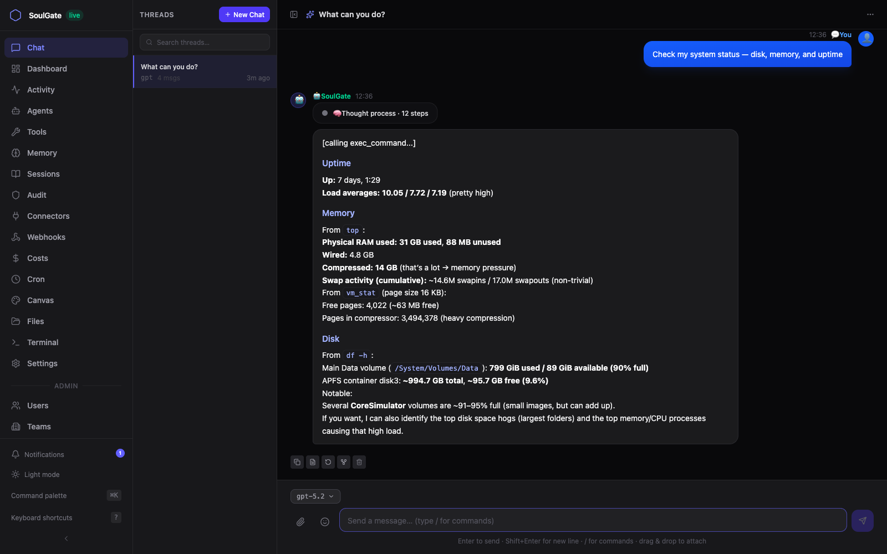
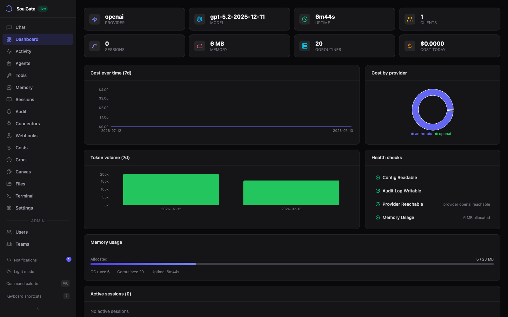
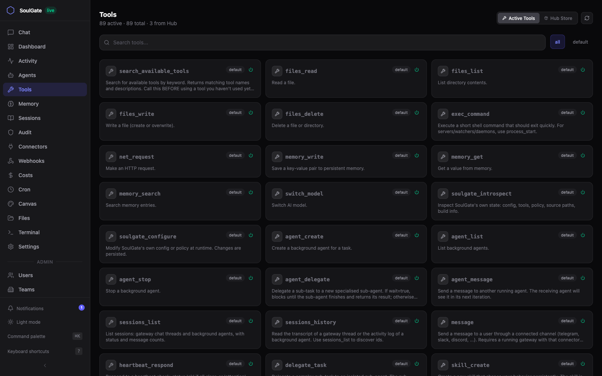
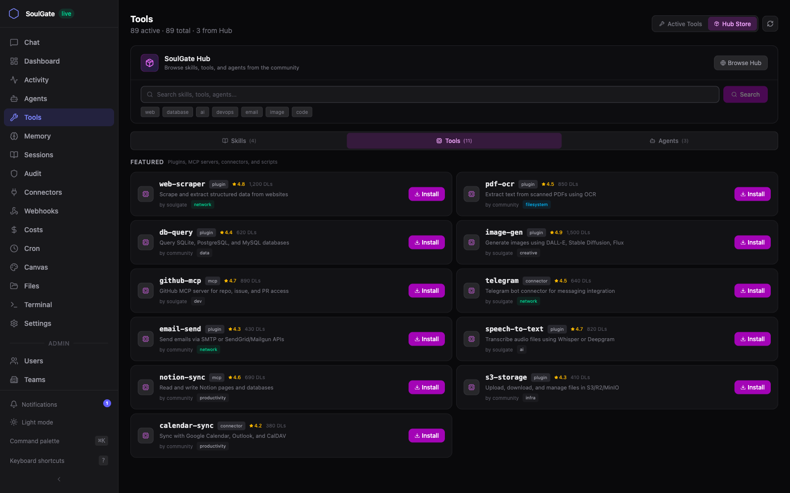
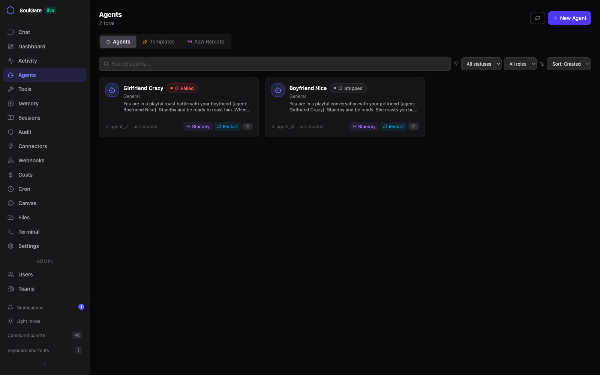
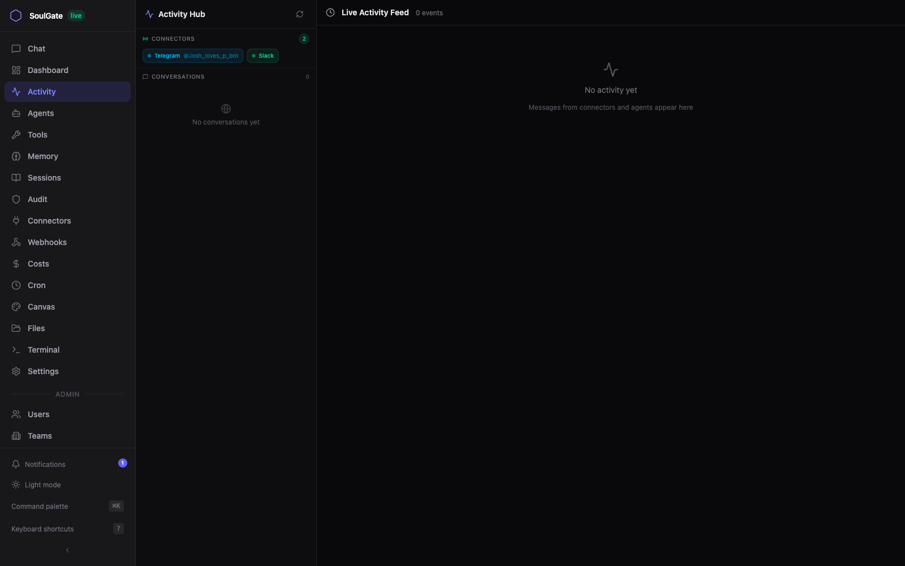
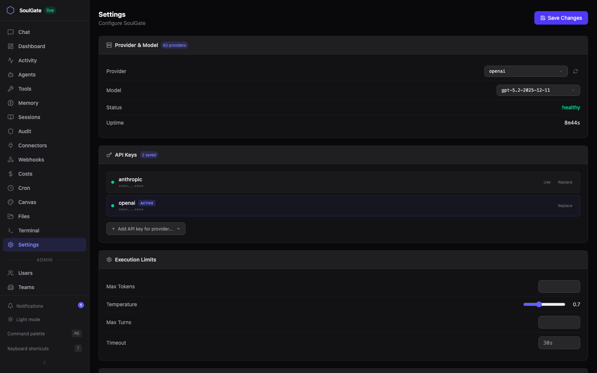

<p align="center">
  
</p>

<h1 align="center">SoulGate</h1>

<p align="center">
  <strong>Your AI, everywhere.</strong> One binary. 13 platforms. 13 model providers. Full system access.
</p>

<p align="center">
  <a href="#quick-start">Quick Start</a> &middot;
  <a href="#web-dashboard">Screenshots</a> &middot;
  <a href="#connectors">Connectors</a> &middot;
  <a href="#tools">Tools</a> &middot;
  <a href="#hub-store">Hub Store</a> &middot;
  <a href="#model-providers">Providers</a> &middot;
  <a href="#security">Security</a>
</p>

<p align="center">
  
  
  
  
  
  
</p>

---

SoulGate is a personal AI gateway that connects any LLM to any messaging platform with full tool access — files, shell, browser, voice, code execution, and more. Deploy once, talk to your AI from Telegram, Discord, Slack, WhatsApp, Signal, Teams, Matrix, iMessage, IRC, Twitch, or the web.

```
soulgate gateway start
```

That's it. Your AI is now reachable from every platform you connect.

---

## Why SoulGate?

| | |
|---|---|
| **One command** | `soulgate gateway start` runs everything: HTTP API, WebSocket, Web UI |
| **13 connectors** | Telegram, Discord, Slack, WhatsApp, Signal, Teams, Matrix, iMessage, IRC, Twitch, Nostr, Mattermost, Feishu |
| **13 providers** | OpenAI, Anthropic, Groq, Gemini, Mistral, DeepSeek, Ollama, and more |
| **45+ tools** | Files, shell, browser automation, voice, image generation, code execution, semantic memory |
| **Multi-agent** | Delegate tasks to specialized sub-agents with roles and messaging |
| **Hub Store** | Install skills, tools, and agents from the community registry |
| **Security-first** | Policy engine, audit logging, permission prompts, workspace boundaries |
| **Self-contained** | Single 43MB Go binary, no runtime dependencies |

---

## Quick Start

```bash
# Install
git clone https://github.com/M4MEET/soulgate.git
cd soulgate && make build

# Configure (interactive — picks provider, enters API key)
./bin/soulgate tui

# Or set key and go
export ANTHROPIC_API_KEY="sk-ant-..."
./bin/soulgate gateway start
```

Open **http://localhost:8080** for the web dashboard. Or connect a messaging platform:

```bash
# Telegram
export TELEGRAM_BOT_TOKEN="..."
soulgate connector telegram

# Discord
export DISCORD_BOT_TOKEN="..."
soulgate connector discord

# Slack (Socket Mode)
export SLACK_BOT_TOKEN="xoxb-..."
export SLACK_APP_TOKEN="xapp-..."
soulgate connector slack

# WhatsApp (scans QR code in terminal)
soulgate connector whatsapp
```

### Docker

```bash
export ANTHROPIC_API_KEY="sk-ant-..."
docker compose up
```

---

## Web Dashboard

SoulGate ships with a full-featured web dashboard at `http://localhost:8080`.

### Chat

Real-time conversations with your AI. Supports tool calls, thinking indicators, multi-turn threads, and model switching.

<p align="center">
  
</p>

### Dashboard

System overview with provider status, cost tracking, token usage, health checks, and memory metrics.

<p align="center">
  
</p>

### Tools

85+ built-in tools — files, shell, browser, computer control, voice, image gen, git, secrets, sessions, memory, and more. Enable/disable tools per session.

<p align="center">
  
</p>

### Hub Store

Browse and install community skills, tools, and agents with one click. Three categories — Skills (behavioral instructions), Tools (plugins, MCP servers, connectors), and Agents (pre-configured templates).

<p align="center">
  
</p>

### Agents

Create and manage autonomous sub-agents with specialized roles. Monitor status, delegate tasks, and view agent conversations.

<p align="center">
  
</p>

### Activity Hub

Live activity feed across all connected platforms — Telegram, Discord, Slack, and the web. View conversation history from every channel in one place.

<p align="center">
  
</p>

### Settings

Configure provider, model, API keys, execution limits, and system behavior from the web UI.

<p align="center">
  
</p>

---

## Connectors

Connect your AI to any messaging platform. Each connector runs as a lightweight process that bridges messages to the gateway.

| Platform | Command | Auth |
|----------|---------|------|
| **Telegram** | `soulgate connector telegram` | `TELEGRAM_BOT_TOKEN` |
| **Discord** | `soulgate connector discord` | `DISCORD_BOT_TOKEN` |
| **Slack** | `soulgate connector slack` | `SLACK_BOT_TOKEN` + `SLACK_APP_TOKEN` |
| **WhatsApp** | `soulgate connector whatsapp` | QR code scan |
| **Signal** | `soulgate connector signal --phone +1234567890` | `signal-cli` |
| **Teams** | `soulgate connector teams` | Azure Bot registration |
| **Matrix** | `soulgate connector matrix` | `MATRIX_HOMESERVER` + `MATRIX_ACCESS_TOKEN` |
| **iMessage** | `soulgate connector imessage` | macOS only |
| **IRC** | `soulgate connector irc` | `IRC_SERVER` + `IRC_CHANNEL` |
| **Twitch** | `soulgate connector twitch` | `TWITCH_TOKEN` |
| **Nostr** | `soulgate connector nostr` | `NOSTR_PRIVATE_KEY` |
| **Mattermost** | `soulgate connector mattermost` | `MATTERMOST_TOKEN` |
| **Feishu** | `soulgate connector feishu` | `FEISHU_APP_ID` + `FEISHU_APP_SECRET` |

---

## Tools

| Category | Tools |
|----------|-------|
| **Files** | read, write, list, delete, apply_patch |
| **Shell** | exec_command, process management (start/list/poll/log/write/kill) |
| **Web** | web_search, web_fetch, net_request |
| **Browser** | open, screenshot, click, type, eval, html (via Chrome DevTools) |
| **Voice** | speak (TTS), transcribe (STT) via OpenAI |
| **Images** | generate (DALL-E 3 / FAL.ai), edit |
| **Canvas** | create, update, list, preview (HTML/React/SVG/Mermaid artifacts) |
| **Memory** | key-value (write/get/search) + vector embeddings (index/recall/forget) |
| **Agents** | create, list, stop, delegate, message |
| **Sessions** | sessions_list, sessions_history (inspect chat threads & agent activity) |
| **Channels** | message (send to telegram/slack/... through the gateway) |
| **Code** | code_run (Python/Node/Go/Bash/Ruby), code_install |
| **Git** | status, diff, commit, log, branch, stash |
| **Secrets** | set, list, delete, inject (encrypted at rest, never shown to the model) |
| **Other** | pdf_read, cron scheduling, heartbeat_respond, LLM task, model switching, introspect, configure |

---

## Hub Store

Install community-built extensions with one command:

```bash
soulgate hub install skill:kubernetes-ops    # Behavioral instructions
soulgate hub install tool:web-scraper        # Plugin / MCP server / connector
soulgate hub install agent:code-reviewer     # Agent template
```

Browse the store from the CLI or the Web UI:

```bash
soulgate hub search "database"
soulgate hub list
soulgate hub info tool:web-scraper
```

Legacy type names (`plugin`, `mcp`, `connector`, `extension`) are still accepted for backward compatibility.

---

## Model Providers

| Provider | Models | Env Variable |
|----------|--------|-------------|
| **OpenAI** | GPT-5.2, GPT-5-mini | `OPENAI_API_KEY` |
| **Anthropic** | Claude Sonnet 5, Opus 4.8 | `ANTHROPIC_API_KEY` |
| **Groq** | Llama 3.3 70B | `GROQ_API_KEY` |
| **Google** | Gemini 2.5 Flash | `GOOGLE_API_KEY` |
| **Mistral** | Mistral Large | `MISTRAL_API_KEY` |
| **DeepSeek** | DeepSeek Chat | `DEEPSEEK_API_KEY` |
| **xAI** | Grok | `XAI_API_KEY` |
| **Ollama** | Any local model | (no key needed) |
| **OpenRouter** | 100+ models | `OPENROUTER_API_KEY` |
| **Together** | Llama, Mixtral | `TOGETHER_API_KEY` |
| **Perplexity** | Sonar | `PERPLEXITY_API_KEY` |
| **Cohere** | Command R+ | `COHERE_API_KEY` |
| **Azure** | Azure-hosted OpenAI models | `AZURE_OPENAI_API_KEY` |

Switch models at runtime from the Web UI settings or via the `switch_model` tool.

---

## Architecture

```
User --> Connector --> Gateway --> Orchestrator --> Model Provider
              |           |            |
         Telegram      Web UI      Tool Execution
         Discord     WebSocket    |-- Files, Shell
         Slack        HTTP API    |-- Browser (Chrome)
         WhatsApp                 |-- Voice (TTS/STT)
         Signal                   |-- Code Sandbox
         Teams                    |-- Image Gen (DALL-E)
         Matrix                   |-- Web Search
         iMessage                 |-- Semantic Memory
         IRC/Twitch               +-- Canvas/Artifacts
         Nostr
         Mattermost
         Feishu
```

---

## CLI Reference

```
soulgate tui                    # Interactive terminal UI
soulgate gateway start          # Start gateway (HTTP + WebSocket + Web UI)
soulgate connector <platform>   # Connect a messaging platform
soulgate hub search <query>     # Search the Hub store
soulgate hub install <type:name># Install a skill, tool, or agent
soulgate doctor                 # Diagnose configuration
soulgate reset --scope sessions # Clear conversation history
soulgate backup                 # Backup config and data
soulgate daemon start           # Run as background service
soulgate config show            # View current config
soulgate sessions export <id>   # Export session to JSON/Markdown/HTML
soulgate sessions search <q>    # Search across sessions
soulgate webhook add <name>     # Add inbound webhook
soulgate skills list            # List available skills
```

---

## Webhooks

Receive events from GitHub, GitLab, or any service:

```bash
# Add a webhook
soulgate webhook add github-push --format github --secret my-secret

# GitHub sends to: POST http://your-server:8080/webhook/github-push
# SoulGate processes the event and can respond via any connected channel
```

---

## Security

- **Policy engine** — allow/deny/require-approval rules for every tool
- **Audit logging** — every operation logged to date-rotated JSONL files
- **Permission prompts** — interactive approve/deny/learn in the TUI
- **Workspace boundaries** — file operations scoped to workspace by default
- **Trust mode** — temporary bypass with auto-expiry (30 min)

---

## Development

```bash
make build          # Build binary
make test           # Run tests
make lint           # Format and vet
soulgate doctor     # Check installation
```

---

## License

MIT
